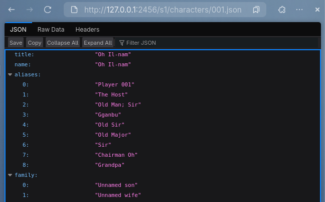

# squid-game-api
an API containing JSON content about Squid Game.

Built with Python via FastAPI.


# Seasons 
   - [Season 1](https://github.com/stainlesteel/squid-game-api/tree/main/s1)
   - [Season 2](https://github.com/stainlesteel/squid-game-api/tree/main/s2)
### Why no season 3?
Season 3 is just the second half of Season 2. As such, all contents of season 3 are added into season 2, including the episodes. 
When running the server, season 3 is added and you can access it's characters and episodes, but they will come from Season 2's folder.
# Run
## GNU/Linux/BSD && MacOS && Windows
Here are the instructions to run on any GNU-based Linux or BSD system, as well as MacOS and Windows, albeit maybe with some different terminal commands.
1. Download the files (either via, git clone "{github .git url}" or  downloading the zip)
2. Go to the root of the folder
3. Open a terminal (zsh, bash, fish, .etc)
4. Have these python dependenices installed (via pip3): fastapi, uvicorn 
5. `uvicorn main:app --reload --port 2456 # or whatever other port`
## Docker
Docker files are provided for both the API and the discord bot, as well as a yml for Docker Compose.
To run with compose, copy the docker files and the app files and then run:

```bash
sudo docker compose up -d --build
```

In the docker-compose.yml, you can modify either the WEBUI port (for API instance) or Discord API token (Discord Bot).
# Apps using the API
## Basic Instance (Github Pages)
There is a Github Pages link you can use for an extremely basic frontend that just prints JSON.

To use it, select a season `(/s1)` or `(/s2)`, 

add `/characters` or `/episodes` or `/episodes-s3` (for `/s2`), and then add the name of the .JSON.

For characters, it's the person number (i.e. 001.json).

For episodes, it's the episode name with under-dashes (One_Last_Game.json).
## Discord fetcher bot
There is a simple discord bot built in Py-Cord (Python).

This bot fetches characters/episodes from the github pages instance and cannot be changed.

In apps/dcd-bot, you can view the .py file and it's packages requirements file for pip. I cannot host the bot myself.

To host, you need to create a app on Discord Developers Portal, and get the bot API key, and for adding it to a server, it needs bot, and application.commands permissions in the 'OAuth2' section.

You can also host it with docker!

```bash
sudo docker compose up -d --build
```
# Contribute
There are some issues that should be fixed below:
1. Some JSON files have /n or other typos made by AI. I won't go through all of these (912) files but if you found an error, you can open an issue so I can fix it or open a PR so I can approve it.
